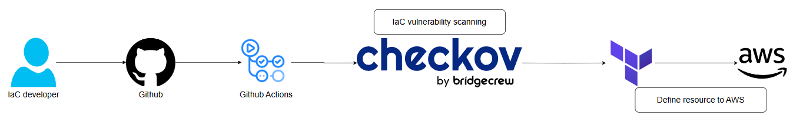
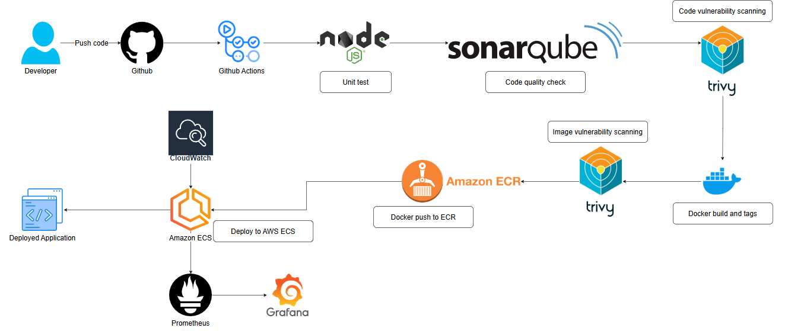
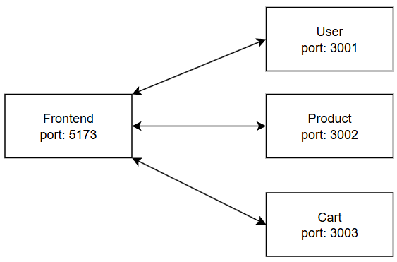
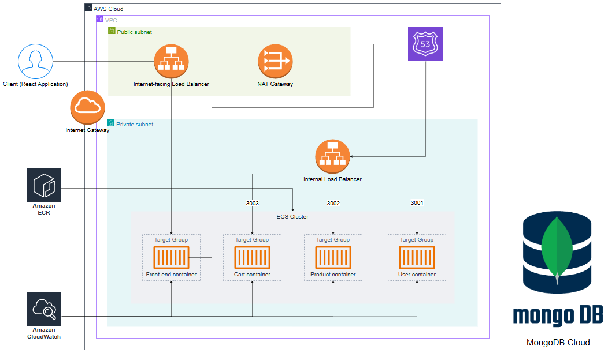

# SPECIALIZED PROJECT
### Topic: Building a DevSecOps Pipeline for an E - commerce Web Applications Based on Microservices Architecture
#### Instructor: MSc. Lê Anh Tuấn
#### Project Implementer:
- 21521389 - Vũ Tuấn Sơn
- 21521052 - Lê Thanh Lâm

## I. Pipeline
#### Note: this is just the pipeline for dev environment!
In this project, we separate the pipeline into 2 phase:
- **Phase 1:** building infrastructure on AWS using Terraform  
    First, we create Terraform modules code in local, then push it to Github.  
    Then, a Github Actions workflow will be triggered to automatically scan the IaC code vulnerability using Checkov.  
    In practice, if the IaC code passes the Checkov test, the process will automatically update the resources in the Cloud environment. However, within the scope of this project, we will not include this step and will only perform up to using Checkov to scan for vulnerabilities.  
    This is an illustration for phase 1:

- **Phase 2:** building the pipeline  
    - This is the most important part of the project, where we take step-by-step actions to integrate security tools into the regular DevOps workflows.  
    - This is an illustration for phase 2:  

## II. Application Architecture
In this project, we built a simple microservices app using NodeJS for the backend and ViteJS for the frontend, as illustrated in the following image:  

## III. Cloud Infrastructure

